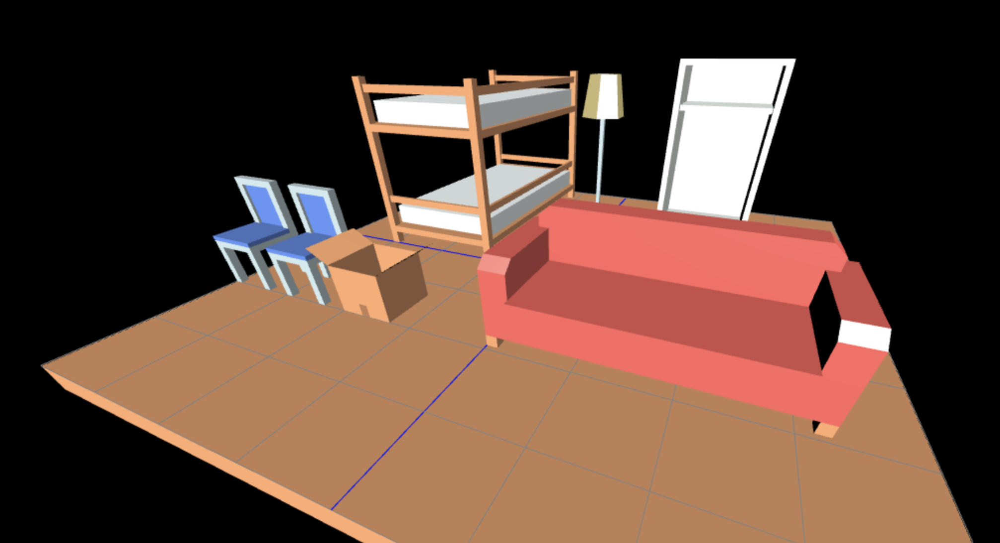
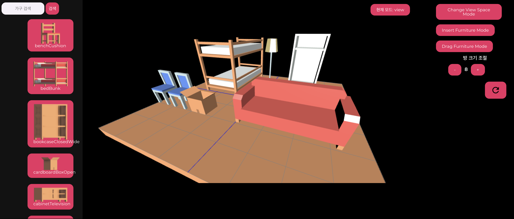
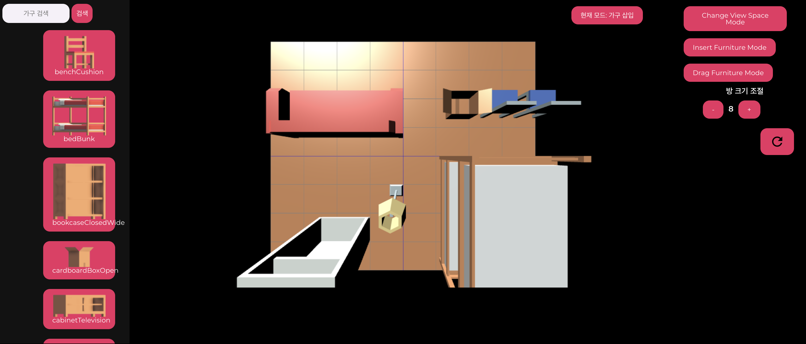

# Show me the room
> Room making Web application with WebGL

__This project requires web server to launch local. Reccomand to use__
[Web Server for Chrome](https://chrome.google.com/webstore/detail/web-server-for-chrome/ofhbbkphhbklhfoeikjpcbhemlocgigb)
 

<pre><a href="https://choring0989.github.io/ShowMeTheRoom">https://chroing0989.github.io/ShowMeTheRoom</a></pre>

 

## ScreenShots

 

## Release History

* 0.0.1
    * Insert obj onclick

* 0.1.0
    * Implement front-end

* 0.2.0
    * Insert obj onclick

* 0.2.1
    * Fix mtl not loading error

* 0.3.0
    * Insert furniture selection button
    * Change light direction
    * Add Drag & Drop function

* 1.0.0
    * First release
    
## Contributors
* [@ChoiysApple](https://github.com/ChoiysApple)
* [@choring0989](https://github.com/choring0989)
* [@KIMDAWUN](https://github.com/KIMDAWUN)
* [@eom012](https://github.com/eom012)

## Tech Stack
* [WebGL](https://webglfundamentals.org/)
* [three.js](https://threejs.org/)

## Asset used
* [Furniture Kit](https://www.kenney.nl/assets/furniture-kit) from [Keeny](https://www.kenney.nl/assets)
* (CC0 1.0 Universal) 

 

